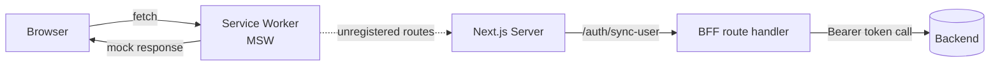
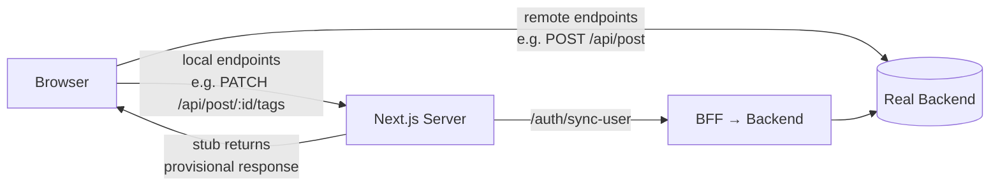
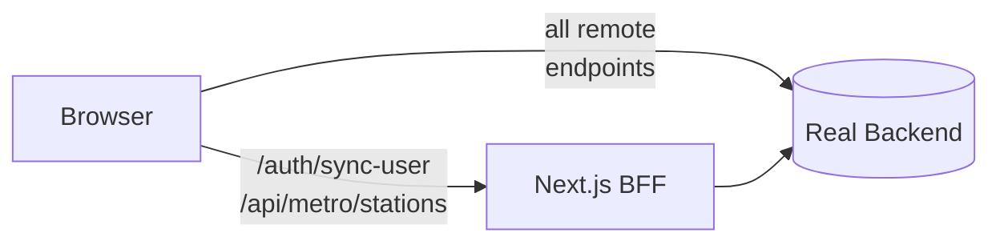

# Frontend API Layer

## Overview

The frontend and backend teams work in parallel on separate schedules. Rather than blocking frontend progress on unimplemented backend endpoints, the Next.js server layer provides **provisional implementations** for endpoints that are not yet ready. As the backend team ships each endpoint, the provisional implementation is deleted and the frontend calls the real service directly.

This lets both teams advance at full speed: the backend implements endpoints one by one, and the frontend integrates each one by making a small, localised change.


## The URL Resolver (`src/lib/api/index.ts`)

All API URLs are defined in one place. Two helper functions decide where a request goes:

```typescript
const useMSW = process.env.NEXT_PUBLIC_ENABLE_MSW === 'true';
const apiBase = process.env.NEXT_PUBLIC_API_URL ?? '';

// Goes to the real backend when configured; otherwise stays relative (MSW intercepts)
function remote(path: string): string {
  return !useMSW && apiBase ? `${apiBase}${path}` : path;
}

// Always stays within Next.js (BFF route handler or provisional stub)
function local(path: string): string {
  return path;
}
```

| Function | When to use |
|----------|-------------|
| `remote()` | Backend has implemented this endpoint |
| `local()` | Backend has **not yet** implemented this endpoint, or the endpoint is frontend-owned forever |

Hooks and components call `api.xxx()` and never construct URLs themselves:

```typescript
// src/lib/api/index.ts
export const api = {
  syncUser:      () => local('/auth/sync-user'),                   // BFF — always local
  tags:          () => remote('/api/tag'),                         // backend: implemented
  metroStations: () => local('/api/metro/stations'),               // frontend-owned forever
  user:          (id: string) => local(`/api/user/${id}`),        // backend issue #46
  userImage:     (id: string) => remote(`/api/image/user/${id}`), // backend: implemented
  post:          () => remote('/api/post'),                        // backend: implemented
  postImages:    (id: string) => remote(`/api/image/post/${id}`), // backend: implemented
  postTags:      (id: string) => local(`/api/post/${id}/tags`),   // backend issue #48
};
```

---

## Endpoint Lifecycle

```
┌────────────────────────────────────────────────────────────────────┐
│                     Adding a new endpoint                          │
└────────────────────────────────────────────────────────────────────┘

  Backend not ready                    Backend ships it
        │                                     │
        ▼                                     ▼
  api.myEndpoint = local('/api/...')    1. Delete src/app/api/.../route.ts
  src/app/api/.../route.ts (stub)       2. Change local() → remote()
        │                               3. Update MSW handler path if needed
        ▼
  Next.js serves the stub
  (returns provisional response)
```

### Step-by-step: adding a not-yet-ready endpoint

1. Add the entry in `src/lib/api/index.ts` using `local()`.
2. Create `src/app/api/<path>/route.ts` that returns a provisional response matching the expected contract (shape, status code).
3. Add an MSW handler in `src/lib/msw/mocks/handlers/` matching the same path pattern.

### Step-by-step: promoting an endpoint (backend just shipped it)

1. Delete `src/app/api/<path>/route.ts`.
2. In `src/lib/api/index.ts`, change `local(...)` → `remote(...)`.
3. Verify the MSW handler path still matches (it should, since the backend path matches what was stubbed).
4. Run `npx playwright test` to confirm nothing broke.

---

## Environment Matrix

| Environment | `NEXT_PUBLIC_ENABLE_MSW` | `NEXT_PUBLIC_API_URL` | `remote()` goes to | `local()` goes to |
|-------------|--------------------------|----------------------|---------------------|-------------------|
| Local dev | `true` | — | relative path → **MSW intercepts** | Next.js route handler |
| Demo deploy | `true` | — | relative path → **MSW intercepts** | Next.js route handler |
| Staging / production | `false` | `https://api.vtrna.com` | **real backend** | Next.js route handler |
| Staging (partial backend) | `false` | set | implemented endpoints → backend; unimplemented → **stub via `local()`** | Next.js route handler |

The same code is deployed across all environments. Only the environment variables differ.

---

## MSW Role

MSW (Mock Service Worker) runs **only in the browser** when `NEXT_PUBLIC_ENABLE_MSW=true`. It intercepts `fetch` calls at the service worker level and returns mock responses without hitting any server.

- **Used in**: local development, demo deployments, Playwright integration tests.
- **Not used in**: production. MSW is never a dependency for production correctness.
- **Relationship to stubs**: MSW and the Next.js stubs cover the same endpoints but serve different purposes:
  - MSW → browser-level interception for dev and tests, full scenario control (`FULL`, `NEW`, error scenarios).
  - Next.js stubs → server-side provisional implementations for production deployments where the backend is not yet complete.

```
Dev / demo (MSW=true):
  fetch('/api/post') → Service Worker → MSW handler → mock response

Production (MSW=false, API_URL set):
  fetch('/api/post')                  → real backend
  fetch('/api/post/123/tags')  ──┐
  fetch('/api/user/456')       ──┤  → Next.js route handler (stub)
  fetch('/api/metro/stations') ──┘     until backend ships #46, #48
```

---

## Flow Diagrams

### Local development / demo (`NEXT_PUBLIC_ENABLE_MSW=true`)



### Production with partial backend (`NEXT_PUBLIC_ENABLE_MSW=false`)



### Full production (`NEXT_PUBLIC_ENABLE_MSW=false`, all endpoints implemented)



---

## Next.js as a BFF

Using Next.js route handlers for both provisional stubs and permanent BFF endpoints is an instance of the **Backend For Frontend** pattern:

- **`/auth/sync-user`** — permanent BFF. Acquires an Auth0 access token server-side and calls the backend. The frontend never handles raw Auth0 tokens directly.
- **`/api/metro/stations`** — permanent frontend-owned endpoint. Metro station data belongs to the frontend; the main backend will never own it.
- **`/api/user/:id`, `/api/post/:id/tags`** — provisional stubs. They exist only until the backend ships issues #46 and #48. Deleting them and switching to `remote()` is the entire integration step.

This design keeps the frontend **independently deployable** at every stage of backend development, without compromising the production architecture once the backend is complete.
