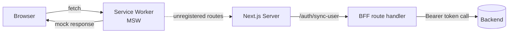
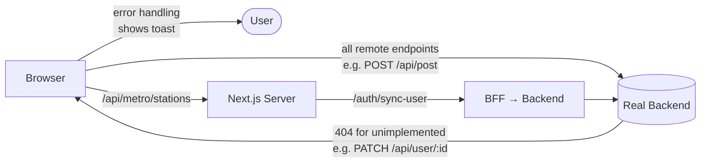
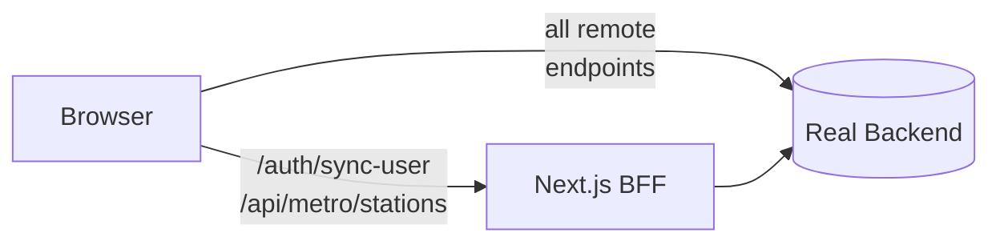

# Frontend API Layer

## Overview

The frontend and backend teams work in parallel on separate schedules. Endpoints that are not yet ready in the backend use `remote()` — they call the real backend when `API_URL` is configured, and fail gracefully (error toast or redirect) if the backend returns 404 or a network error. MSW intercepts all requests during local development and tests.

As the backend team ships each endpoint, the frontend integrates it by verifying that existing error handling covers the real response shape — no stub to delete, no code path to change.


## The URL Resolver (`src/lib/api/index.ts`)

All API URLs are defined in one place. Two helper functions decide where a request goes:

```typescript
const useMSW = process.env.NEXT_PUBLIC_ENABLE_MSW === 'true';
const apiBase = process.env.NEXT_PUBLIC_API_URL ?? '';

// Goes to the real backend when configured; otherwise stays relative (MSW intercepts)
function remote(path: string): string {
  return !useMSW && apiBase ? `${apiBase}${path}` : path;
}

// Always stays within Next.js (BFF route handler or provisional stub)
function local(path: string): string {
  return path;
}
```

| Function | When to use |
|----------|-------------|
| `remote()` | All backend endpoints — implemented or not. Fails gracefully if backend returns an error. |
| `local()` | Permanent BFF endpoints or frontend-owned data (never lives in the backend) |

Hooks and components call `api.xxx()` and never construct URLs themselves:

```typescript
// src/lib/api/index.ts
export const api = {
  syncUser:      () => local('/auth/sync-user'),                   // BFF — always local
  tags:          () => remote('/api/tag'),                         // backend: implemented
  metroStations: () => local('/api/metro/stations'),               // frontend-owned forever
  user:          (id: string) => remote(`/api/user/${id}`),       // backend issue #46 (not ready — fails with toast)
  userImage:     (id: string) => remote(`/api/image/user/${id}`), // backend: implemented
  post:          () => remote('/api/post'),                        // backend: implemented
  postImages:    (id: string) => remote(`/api/image/post/${id}`), // backend: implemented
  postTags:      (id: string) => remote(`/api/post/${id}/tags`),  // backend issue #48 (not ready — fails with toast)
};
```

---

## Endpoint Lifecycle

```
┌────────────────────────────────────────────────────────────────────┐
│                     Adding a new endpoint                          │
└────────────────────────────────────────────────────────────────────┘

  Backend not ready                    Backend ships it
        │                                     │
        ▼                                     ▼
  api.myEndpoint = remote('/api/...')   1. Add MSW handler if missing
  MSW handler returns mock response     2. Verify real response shape matches
  Error handling shows toast on 404          what the component expects
                                        3. Run npx playwright test
```

### Step-by-step: adding a backend endpoint

1. Add the entry in `src/lib/api/index.ts` using `remote()`.
2. Add an MSW handler in `src/lib/msw/mocks/handlers/` for local dev and tests.
3. Ensure the caller has error handling for non-ok responses (toast, redirect, or field error).

### Step-by-step: integrating a newly shipped backend endpoint

1. Verify the real response shape matches what the component already expects.
2. If the shape differs (e.g. field renamed), update the component and the MSW handler together.
3. Run `npx playwright test` to confirm nothing broke.

---

## Environment Matrix

| Environment | `NEXT_PUBLIC_ENABLE_MSW` | `NEXT_PUBLIC_API_URL` | `remote()` goes to | `local()` goes to |
|-------------|--------------------------|----------------------|---------------------|-------------------|
| Local dev | `true` | — | relative path → **MSW intercepts** | Next.js route handler |
| Demo deploy | `true` | — | relative path → **MSW intercepts** | Next.js route handler |
| Staging / production | `false` | `https://api.vtrna.com` | **real backend** | Next.js route handler |
| Staging (partial backend) | `false` | set | all endpoints → backend; unimplemented ones return 404 → **error toast** | Next.js route handler |

The same code is deployed across all environments. Only the environment variables differ.

---

## MSW Role

MSW (Mock Service Worker) runs **only in the browser** when `NEXT_PUBLIC_ENABLE_MSW=true`. It intercepts `fetch` calls at the service worker level and returns mock responses without hitting any server.

- **Used in**: local development, demo deployments, Playwright integration tests.
- **Not used in**: production. MSW is never a dependency for production correctness.
- **Relationship to production**: MSW is strictly a dev/test tool. In production (`MSW=false`), all `remote()` calls go to the real backend directly — no Next.js intermediary for backend endpoints.

```
Dev / demo (MSW=true):
  fetch('/api/post') → Service Worker → MSW handler → mock response

Production (MSW=false, API_URL set):
  fetch('/api/post')            → real backend (implemented)
  fetch('/api/post/123/tags')   → real backend (404 until #48 ships → toast)
  fetch('/api/user/456')        → real backend (404 until #46 ships → toast)
  fetch('/api/metro/stations')  → Next.js route handler (frontend-owned forever)
```

---

## Flow Diagrams

### Local development / demo (`NEXT_PUBLIC_ENABLE_MSW=true`)



### Production with partial backend (`NEXT_PUBLIC_ENABLE_MSW=false`)



### Full production (`NEXT_PUBLIC_ENABLE_MSW=false`, all endpoints implemented)



---

## Next.js as a BFF

Using Next.js route handlers for both provisional stubs and permanent BFF endpoints is an instance of the **Backend For Frontend** pattern:

- **`/auth/sync-user`** — permanent BFF. Acquires an Auth0 access token server-side and calls the backend. The frontend never handles raw Auth0 tokens directly.
- **`/api/metro/stations`** — permanent frontend-owned endpoint. Metro station data belongs to the frontend; the main backend will never own it.
- **`/api/user/:id`, `/api/post/:id/tags`** — not yet implemented in backend (#46, #48). Already use `remote()`: they fail with an error toast until the backend ships them. No code change required when backend ships — just verify response shape.

This design keeps the frontend **independently deployable** at every stage of backend development, without compromising the production architecture once the backend is complete.
